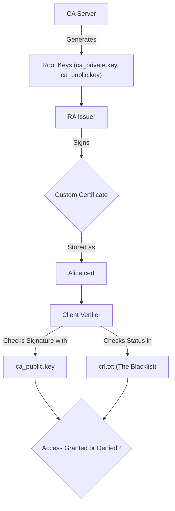

# PKI-Implementation-using-C
Public Key Infrastructure implementation from scratch using C-lang

---
This project is a C-based simulation of a **Public Key Infrastructure (PKI)**.

Think of PKI as a giant club. The **CA** is the club owner, the **RA** is the guy checking IDs at the door, and the **Certificates** are the VIP passes.

---

## 🏗 System Architecture

Below is the high-level flow of how our "Trust Factory" works.

---

## 📦 Module Breakdown

Our project is split into four main "departments," each with a specific job.

### 1\. `pki_core` (The Mathematical Engine)

This is the heart of the system. It doesn't care about "trust" or "security"; it only cares about math.

- **Files**: `pki_core.h`, `pki_core.c`  
- **Job**: Provides the RSA math, hashing functions, and signature logic that everyone else uses.

### 2\. `ca_server` (The Root of All Trust)

The Root Certificate Authority (CA). If the CA says it's true, it's true.

- **Files**: `ca_server.c`  
- **Job**: Generates the master RSA keys. It creates a "Private Key" (which it hides like a dragon's hoard) and a "Public Key" (which it gives to everyone).

### 3\. `ra_issuer` (The ID Desk)

The Registration Authority (RA). In our simplified world, it acts as the issuer.

- **Files**: `ra_issuer.c`  
- **Job**: Takes a name (e.g., "Alice"), generates a pair of keys for them, and then uses the **CA's Private Key** to "stamp" (sign) a certificate.

### 4\. `client_verify` (The Skeptical Guard)

This is the bouncer at the club.

- **Files**: `client_verify.c`  
- **Job**: It takes a certificate, checks if the CA's signature is valid using the **CA's Public Key**, and then checks the **CRL (Certificate Revocation List)** to make sure the user hasn't been kicked out.

---

## 🧙‍♂️ The "Magic" Algorithms

| Algorithm | Function Name | What it actually does |
| :---- | :---- | :---- |
| **RSA ModExp** | `mod_exp()` | The "Padlock." It calculates $base^{exp} \\pmod{mod}$. This is how we encrypt and decrypt. |
| **GCD** | `gcd()` | Finds the Greatest Common Divisor. We use this to make sure our keys are "math-friends" (coprime). |
| **Mod Inverse** | `mod_inverse()` | The "Key Maker." It finds the secret number $d$ that reverses the public number $e$. |
| **DJB2 Hash** | `simple_hash()` | The "Blender." It takes a complex certificate struct and mashes it into a single number. If even one letter in the name changes, the number changes completely. |

---

## 🔑 Variable Glossary

| Variable | Type | What it represents |
| :---- | :---- | :---- |
| `n` | `uint64_t` | The **Modulus**. This is the "Public Square" where all the math happens. |
| `e` | `uint64_t` | The **Public Exponent**. Usually 3 or 65537\. It's the "Locking" mechanism. |
| `d` | `uint64_t` | The **Private Exponent**. This is the secret sauce. If you lose this, game over. |
| `serial_number` | `uint64_t` | A unique ID for each certificate. Essential for the CRL. |
| `signature` | `uint64_t` | The result of the CA encrypting the hash of the cert with its private key. |

---

## 🚀 How to Run the Show

1. **Build the system**:  
     
   make  
     
2. **Initialize the CA**:  
     
   ./ca\_server  
     
3. **Issue a Certificate for Alice**:  
     
   ./ra\_issuer Alice  
     
4. **Verify Alice's Certificate**:  
     
   ./client\_verify Alice.cert  
     
5. **Revoke Alice (The Drama Step)**: Add Alice's serial number to a file named `crl.txt` and watch the verifier reject her\!

